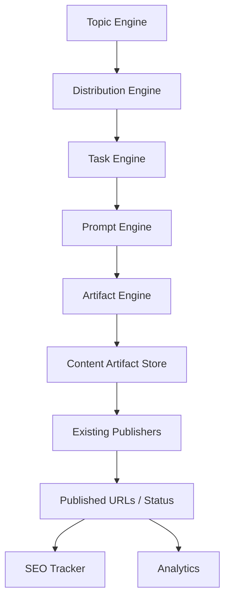

# TakkenAI Content Orchestrator 系统方案设计

## 1. 设计目标

在不重写现有发布系统的前提下，新建一个“主题驱动型内容运营中台（Content Orchestrator）”，让内容生产流程从：

`平台选题 -> 平台生成 -> 平台发布`

升级为：

`主题规划 -> 传播规划 -> 任务拆分 -> 内容生成 -> 资产沉淀 -> 发布执行 -> SEO追踪`

核心原则：

1. 保留现有发布器，避免大重构。
2. 生成与发布彻底解耦。
3. 所有内容先成为 Artifact，再进入发布。
4. 中台负责“内容运营决策”，发布器负责“最终执行”。

---

## 2. 总体架构



### 中台职责

- Topic Engine：管理主题资产、主题优先级、目标关键词、业务目标。
- Distribution Engine：针对主题生成多平台传播规划。
- Content Angle Engine：为同一主题的不同平台生成差异化内容角度。
- Task Engine：把传播规划拆分成可执行任务。
- Prompt Engine：按平台选择对应 prompt 模板。
- Artifact Engine：负责内容生成、版本管理、审核状态管理。
- SEO Tracker：沉淀外链、锚文本、目标页、收录状态。
- Analytics：统计任务完成率、内容产出量、平台覆盖度、SEO资产增长。

### 现有发布系统职责

- `note-auto-publisher`：消费 note artifact 并发布。
- `zenn-hatena-publisher`：消费 zenn / hatena artifact 并发布。
- `social-auto-publisher`：消费 x / bluesky artifact 并发布。
- `ppt-auto-generator`：消费 ppt artifact，生成 PPT 并发布。

它们不再负责：

- 选题
- Prompt 策略
- SEO 逻辑
- 传播规划
- 内容生成

---

## 3. 目标边界与非目标

### 本系统负责

- 主题资产管理
- 平台传播规划
- 内容任务拆分
- 内容生成与版本沉淀
- 发布前审核流
- 发布任务派发
- 发布结果回写
- SEO 资产记录

### 本系统暂不负责

- 重写已有发布器
- 替代已有登录、发文、重试逻辑
- 统一所有平台的底层发布实现
- Quora / 短视频的完全自动发布

### 对外系统关系

- 中台作为上游控制层。
- 发布系统作为下游执行层。
- 人工运营平台可通过中台领取任务，但执行仍可保持人工。

---

## 4. 关键设计原则

## 4.1 主题驱动

中台中的最小业务单元不是“某平台文章”，而是“主题”。

例如主题：

- `不動産SNS投稿AI`

围绕这个主题，中台自动展开：

- note 经验文
- Hatena SEO教程
- Zenn 技术文
- X 短帖
- Bluesky 讨论
- PPT 讲解稿

## 4.2 生成与发布解耦

新链路必须固定为：

`Topic -> Task -> Artifact -> Publish`

发布系统不再直接调用 AI，也不直接从 topic 生成内容。

## 4.3 Artifact First

所有内容必须先写入 `content_artifacts`，再进入发布队列。

好处：

- 可审核
- 可复用
- 可回溯
- 可统计
- 可多次分发
- 可支持人工微调

## 4.4 最小侵入式改造

对已有系统只做“输入源切换”：

- 从“读取 topic 并生成”改为“读取 artifact 并发布”

---

## 5. 核心模块设计

## 5.1 Topic Engine

负责主题生命周期管理。

### 关键能力

- 创建主题
- 维护主题集群
- 定义业务目标
- 维护目标关键词
- 设置优先级
- 指定目标平台
- 控制主题状态

### 建议状态机

- `draft`
- `ready`
- `planned`
- `in_progress`
- `completed`
- `archived`

## 5.2 Distribution Engine

根据主题和目标平台，生成传播矩阵。

### 输入

- topic
- business_goal
- target_keyword
- target_platforms

### 输出示例

| platform | content_type | objective |
| --- | --- | --- |
| note | article | 品牌认知 |
| hatena | article | SEO外链 |
| zenn | technical_article | 技术权威 |
| x | short_post | 流量触达 |
| bluesky | discussion | 话题互动 |
| ppt | slides | 资产再包装 |

## 5.3 Content Angle Engine

同一主题下，为不同平台生成不同内容角度，避免重复。

### 示例

主题：`不動産SNS投稿AI`

| platform | angle |
| --- | --- |
| note | 为什么房产账号发不动 |
| hatena | 可直接套用的内容模板 |
| zenn | 自动化工作流实现方式 |
| x | 3个快速提效技巧 |
| bluesky | 对行业现状的讨论切口 |
| ppt | 团队运营方法论拆解 |

### 规则

- 一个主题下，平台角度不得重复。
- 优先保证搜索意图和平台语境匹配。
- 支持后续人工覆写。

## 5.4 Task Engine

把平台规划转换为标准任务。

### 任务类型

- `generate_content`
- `review_content`
- `publish_content`
- `track_seo`
- `refresh_content`

### 任务拆分示例

一个 topic 进入执行后，自动生成：

1. note 生成任务
2. hatena 生成任务
3. zenn 生成任务
4. x 生成任务
5. bluesky 生成任务
6. ppt 生成任务
7. 各平台发布任务
8. 发布后 SEO 记录任务

## 5.5 Prompt Engine

管理按平台拆分的 Prompt 模板。

### 原则

- 每个平台一套 prompt，不混用。
- prompt version 可追踪。
- 支持 A/B 版本。
- 支持按内容类型细分。

### 建议目录

```text
/content-orchestrator
  /app
    /prompts
      /note
      /hatena
      /zenn
      /x
      /bluesky
      /ppt
```

## 5.6 Artifact Engine

负责生成、存储、更新内容资产。

### 核心职责

- 根据任务选择 prompt
- 调用 LLM 生成草稿
- 生成结构化 artifact
- 管理版本
- 管理审核状态
- 管理发布状态

### Artifact 生命周期

- `draft`
- `generated`
- `review_pending`
- `approved`
- `rejected`
- `publish_pending`
- `published`
- `failed`

## 5.7 SEO Tracker

记录发布后产生的 SEO 资产。

### 追踪内容

- 来源平台
- 来源 URL
- 目标页 URL
- 锚文本
- referring domain
- 是否收录
- 首次发现时间
- 最近检查时间

## 5.8 Analytics

第一阶段可以先做基础统计：

- topic 数量
- 各平台 artifact 数量
- 生成成功率
- 发布成功率
- 已形成的 referring domains
- 每个 topic 的覆盖平台数

---

## 6. 数据模型设计

## 6.1 topics

| 字段 | 类型 | 说明 |
| --- | --- | --- |
| id | string | topic_id |
| master_topic | string | 主题名 |
| topic_cluster | string | 主题集群 |
| business_goal | string | SEO / branding / traffic |
| target_keyword | string | 目标关键词 |
| priority | string | S / A / B / C |
| target_platforms | json/array | 平台列表 |
| status | string | draft/ready/planned/... |
| brief | text | 主题说明 |
| created_at | datetime | 创建时间 |
| updated_at | datetime | 更新时间 |

## 6.2 distribution_tasks

| 字段 | 类型 | 说明 |
| --- | --- | --- |
| id | string | task_id |
| topic_id | string | 关联主题 |
| platform | string | note/x/zenn/... |
| task_type | string | generate/review/publish/seo |
| content_type | string | article/thread/slides |
| angle | string | 内容角度 |
| status | string | pending/running/completed/failed |
| priority | string | 任务优先级 |
| depends_on | json/array | 依赖任务 |
| artifact_id | string nullable | 关联 artifact |
| scheduled_at | datetime nullable | 计划执行时间 |
| completed_at | datetime nullable | 完成时间 |
| error_message | text nullable | 失败原因 |

## 6.3 content_artifacts

| 字段 | 类型 | 说明 |
| --- | --- | --- |
| id | string | artifact_id |
| topic_id | string | 关联主题 |
| task_id | string | 来源任务 |
| platform | string | note/x/zenn/... |
| content_type | string | article/post/slides |
| angle | string | 内容角度 |
| title | string nullable | 标题 |
| summary | text nullable | 摘要 |
| content | text/json | 正文或结构化内容 |
| format | string | markdown/json/text |
| prompt_version | string | prompt版本 |
| generation_model | string | 使用模型 |
| status | string | generated/approved/published/... |
| reviewed | boolean | 是否审核 |
| reviewed_by | string nullable | 审核人 |
| review_notes | text nullable | 审核备注 |
| published | boolean | 是否已发布 |
| published_url | string nullable | 发布链接 |
| external_publish_id | string nullable | 平台返回的id |
| version | int | 版本号 |
| created_at | datetime | 创建时间 |
| updated_at | datetime | 更新时间 |

## 6.4 seo_assets

| 字段 | 类型 | 说明 |
| --- | --- | --- |
| id | string | seo_asset_id |
| artifact_id | string | 来源 artifact |
| topic_id | string | 来源 topic |
| source_platform | string | 来源平台 |
| source_url | string | 外链页面 |
| target_url | string | 指向页面 |
| anchor_text | string | 锚文本 |
| rd_domain | string | referring domain |
| indexed | boolean | 是否收录 |
| first_seen_at | datetime | 首次记录时间 |
| last_checked_at | datetime nullable | 最近检查时间 |

## 6.5 publishers（可选）

如果后续需要统一下游发布器对接配置，可增加：

| 字段 | 类型 | 说明 |
| --- | --- | --- |
| id | string | publisher_id |
| platform | string | 平台 |
| consumer_name | string | 下游消费者名称 |
| enabled | boolean | 是否启用 |
| artifact_filter | json | 任务筛选条件 |

---

## 7. 核心流程设计

## 7.1 主题进入执行

1. 运营录入 topic。
2. Topic Engine 校验字段完整性。
3. Distribution Engine 生成平台传播规划。
4. Content Angle Engine 生成每个平台角度。
5. Task Engine 生成各平台 `generate_content` 任务。

## 7.2 内容生成

1. 生成任务进入队列。
2. Prompt Engine 按平台加载模板。
3. Artifact Engine 调用 LLM 生成内容。
4. 生成结果写入 `content_artifacts`。
5. 任务状态更新为 `completed`，artifact 状态更新为 `generated`。

## 7.3 审核与发布

1. 审核通过后，artifact 状态改为 `approved`。
2. Task Engine 生成 `publish_content` 任务。
3. 下游发布器读取对应平台 artifact。
4. 发布成功后回写 `published_url`、`published=true`、`status=published`。

## 7.4 SEO 回写

1. 发布成功触发 `track_seo` 任务。
2. SEO Tracker 记录外链资产。
3. 后续可增量检查收录状态。

---

## 8. 与现有发布系统的对接契约

目标是让每个发布器只新增“artifact 消费层”，不改核心发布能力。

## 8.1 统一输入契约

每个发布器只需要能拿到：

- artifact_id
- platform
- content_type
- title
- content
- metadata（可选，如标签、封面、线程拆分信息）

### 示例 JSON

```json
{
  "artifact_id": "art_001",
  "topic_id": "topic_001",
  "platform": "note",
  "content_type": "article",
  "title": "不動産SNS投稿AI：为什么房产账号总是发不动",
  "content": "# 正文 markdown ...",
  "status": "approved",
  "metadata": {
    "tags": ["AI", "SNS", "不動産"],
    "target_keyword": "不動産 SNS 投稿 AI"
  }
}
```

## 8.2 统一回写契约

发布器发布后回写：

```json
{
  "artifact_id": "art_001",
  "published": true,
  "published_url": "https://example.com/post/123",
  "external_publish_id": "123",
  "published_at": "2026-05-14T10:00:00Z",
  "status": "published",
  "error_message": null
}
```

## 8.3 对接方式建议

第一阶段推荐最简单的拉取式集成：

- 发布器定时轮询 `publish_pending` 的 artifact
- 拉取后尝试发布
- 发布结果通过 API 回写

后续可升级为：

- 队列消费
- webhook 通知

---

## 9. 对现有系统的最小改造建议

## 9.1 note-auto-publisher

### 删除或旁路

- topic selection
- AI generate
- SEO logic
- distribution logic

### 保留

- note 登录
- markdown 发布
- retry
- status update

### 新增

- 读取 note artifact 的适配层
- 发布结果回写

## 9.2 zenn-hatena-publisher

### 删除或旁路

- topic scheduler
- AI generation
- content strategy

### 保留

- markdown handling
- git push
- deploy
- retry

### 新增

- artifact reader
- 发布状态回写

## 9.3 social-auto-publisher

### 删除或旁路

- prompt logic
- topic selection
- scheduling strategy

### 保留

- X publish
- Bluesky publish
- cooldown
- retry

### 新增

- social artifact reader
- 线程拆分 / 短帖适配层
- 回写 published_url

## 9.4 ppt-auto-generator

### 保留

- PPT 生成
- 上传 SpeakerDeck

### 新增

- 读取 `ppt` 类型 artifact
- 根据结构化内容生成 PPT
- 回写结果 URL

---

## 10. 推荐技术架构

因为当前目录为空，建议直接按“中台服务”方式搭第一版。

## 10.1 推荐后端形态

- API 服务：`FastAPI`
- ORM：`SQLAlchemy` 或 `SQLModel`
- 数据库：`PostgreSQL`
- 异步任务：`Celery` / `RQ` / `APScheduler`
- 配置管理：`.env` + settings module
- 日志：结构化日志

如果希望 Phase 1 尽快落地，也可以先简化为：

- FastAPI
- PostgreSQL
- APScheduler
- 单体服务

## 10.2 推荐目录结构

```text
/content-orchestrator
  /app
    /api
    /engines
      topic_engine.py
      distribution_engine.py
      angle_engine.py
      artifact_engine.py
      prompt_engine.py
      seo_engine.py
    /services
      topic_service.py
      task_service.py
      artifact_service.py
      publisher_service.py
    /repositories
      topic_repository.py
      task_repository.py
      artifact_repository.py
      seo_repository.py
    /models
      topic.py
      distribution_task.py
      artifact.py
      seo_asset.py
    /schemas
    /prompts
      /note
      /hatena
      /zenn
      /x
      /bluesky
      /ppt
    /workers
    /core
  /docs
  /tests
```

---

## 11. API / 服务边界建议

## 11.1 中台内部 API

### Topics

- `POST /topics`
- `GET /topics`
- `GET /topics/{topic_id}`
- `PATCH /topics/{topic_id}`
- `POST /topics/{topic_id}/plan`

### Tasks

- `GET /tasks`
- `POST /tasks/{task_id}/run`
- `POST /tasks/{task_id}/retry`

### Artifacts

- `GET /artifacts`
- `GET /artifacts/{artifact_id}`
- `PATCH /artifacts/{artifact_id}/review`
- `POST /artifacts/{artifact_id}/approve`

### Publisher Integration

- `GET /publisher/artifacts?platform=note&status=publish_pending`
- `POST /publisher/artifacts/{artifact_id}/publish-result`

### SEO

- `POST /seo-assets`
- `GET /seo-assets`

## 11.2 发布器对接方式

每个发布器只需要支持两个动作：

1. 拉取待发布 artifact
2. 回写发布结果

这样中台与下游实现低耦合。

---

## 12. Phase 拆分建议

## Phase 1：先把中台骨架立起来

### 目标

中台能独立完成：

- topic 录入
- 平台规划
- 任务创建
- artifact 生成
- artifact 存储

### 交付范围

- `topics` 表
- `distribution_tasks` 表
- `content_artifacts` 表
- Prompt System
- Topic / Distribution / Artifact 基础引擎
- 人工审核字段
- 基础 API

### 暂不做

- 发布器改造
- SEO 自动检查
- 分析看板

## Phase 2：接入现有发布器

### 目标

让 note / zenn / social / ppt 系统从中台读取 artifact。

### 交付范围

- Publisher API
- artifact publish 状态机
- 各发布器适配层
- 回写 published_url

## Phase 3：补齐运营闭环

### 目标

把“内容生产”升级成“SEO 资产运营”。

### 交付范围

- `seo_assets` 表
- 收录检查
- referring domain 统计
- topic 评分
- artifact 复用
- analytics 看板

---

## 13. 风险点与规避策略

## 13.1 风险：平台内容重复

### 规避

- 增加 Content Angle Engine
- artifact 生成前检查同 topic 下已存在角度

## 13.2 风险：发布器改造成本过高

### 规避

- 只改输入与回写层
- 原有发布逻辑不动

## 13.3 风险：中台生成质量不稳定

### 规避

- Prompt 分平台管理
- 增加 review 状态
- 保留人工审批

## 13.4 风险：SEO 数据不完整

### 规避

- 先做手动/半自动回写
- 后续逐步加入自动检查

---

## 14. 第一版落地建议

为了尽快进入开发，建议第一版按以下范围实现：

1. 单体 FastAPI 服务。
2. PostgreSQL 四张核心表：`topics`、`distribution_tasks`、`content_artifacts`、`seo_assets`。
3. 平台先支持：`note`、`hatena`、`zenn`、`x`、`bluesky`、`ppt`。
4. 先使用轮询式发布器对接。
5. 人工审核先用字段状态实现，不急着做完整审核后台。

---

## 15. 结论

这次改造的本质不是“做一个更大的自动发文器”，而是建立一个新的上游控制层：

- 以 Topic 为核心
- 以 Artifact 为中间资产
- 以 Publisher 为执行端
- 以 SEO 资产沉淀为最终目标

最终形成的是：

`SEO Topic Operating System`

而不是：

`Multi-platform Auto Publisher`

这决定了系统的边界、模块划分、数据模型和实施路径。
